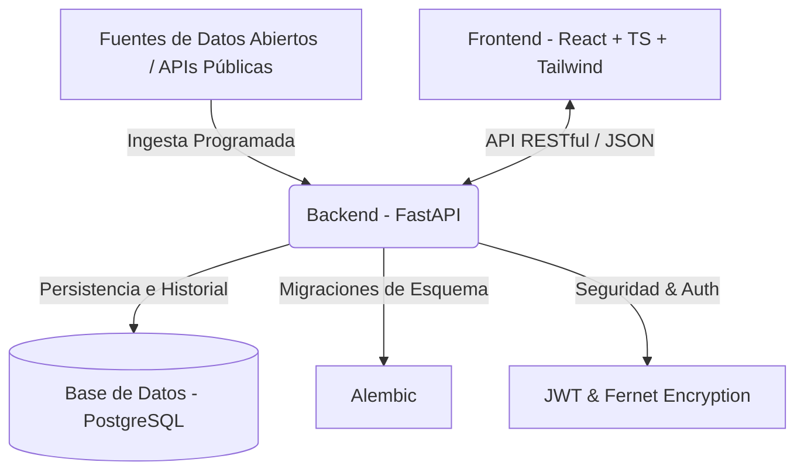

# Plataforma de Detección Temprana de Corrupción mediante Datos Abiertos Públicos 🔍🚫💼

¡Bienvenido al repositorio de la **Plataforma de Detección Temprana de Corrupción mediante Datos Abiertos Públicos**! Este sistema integral permite la ingesta, transformación, análisis predictivo/estadístico y monitoreo de procesos de contratación pública para detectar de manera oportuna anomalías, riesgos de corrupción e inconsistencias en la calidad de los datos analizados.

---

## 🏗️ Arquitectura General

El proyecto está dividido en una arquitectura desacoplada moderna:



---

## 🛠️ Tecnologías Utilizadas

### Backend (API & Procesamiento)
*   **Lenguaje:** [Python 3.10+](https://www.python.org/)
*   **Framework API:** [FastAPI](https://fastapi.tiangolo.com/) (Asíncrono, validación nativa con Pydantic)
*   **Base de Datos / ORM:** [PostgreSQL](https://www.postgresql.org/) & [SQLAlchemy 2.0](https://www.sqlalchemy.org/)
*   **Migraciones:** [Alembic](https://alembic.sqlalchemy.org/)
*   **Programación de Tareas:** [APScheduler](https://apscheduler.readthedocs.io/)
*   **Seguridad:** [Cryptographic Fernet](https://cryptography.io/) & [Python-Jose (JWT)](https://python-jose.readthedocs.io/)

### Frontend (Visualización & Control)
*   **Framework:** [React 19](https://react.dev/) + [TypeScript](https://www.typescriptlang.org/)
*   **Herramienta de Construcción:** [Vite 8](https://vite.dev/)
*   **Estilos:** [Tailwind CSS v4](https://tailwindcss.com/)
*   **Visualización de Datos:** [Recharts](https://recharts.org/) (Gráficos interactivos de calidad y analítica)
*   **Gestión de Formularios:** [React Hook Form](https://react-hook-form.com/) & [Zod](https://zod.dev/)
*   **Reportes:** [jsPDF](https://github.com/parallax/jsPDF) & [SheetJS (XLSX)](https://sheetjs.com/)

---

## 📂 Estructura del Repositorio

La raíz del repositorio está organizada de la siguiente manera:

```text
├── Backend/                 # API FastAPI, procesos ETL, base de datos y analítica
│   ├── core/                # Configuración global, tareas programadas (Scheduler) y seguridad
│   ├── database/            # Conexión ORM y migraciones con Alembic
│   ├── gateway/             # Enrutador principal de endpoints de la API (API Router)
│   ├── modules/             # Lógica modular: ingesta, transformacion, analitica, auth y visualizacion
│   ├── requirements.txt     # Dependencias de Python
│   └── main.py              # Punto de entrada de la aplicación FastAPI
│
├── Frontend/                # Aplicación cliente React en TypeScript
│   ├── src/
│   │   ├── api/             # Clientes de conexión HTTP con Axios
│   │   ├── components/      # Componentes de UI reutilizables
│   │   ├── context/         # Estados globales (Autenticación, etc.)
│   │   ├── pages/           # Vistas (Dashboard Público, Panel Admin, Calidad de Datos, etc.)
│   │   ├── services/        # Consumo y mapeo de servicios de backend
│   │   └── main.tsx         # Punto de entrada del cliente
│   ├── package.json         # Scripts y dependencias del cliente
│   └── vite.config.ts       # Configuración del empaquetador Vite
│
└── README.md                # Esta guía de introducción general
```

---

## 🚀 Inicio Rápido

Para desplegar y ejecutar el proyecto en tu entorno local, sigue las instrucciones detalladas en las guías de configuración específicas:

1.  **Configuración del Servidor y Base de Datos:**
    👉 Consulta el [README del Backend](file:///c:/PLATAFORMA-DE-DETECCION-TEMPRANA-DE-CORRUPCION-MEDIANTE-DATOS-ABIERTOS-PUBLICOS/Backend/README.md) para instalar dependencias, configurar variables de entorno (`.env`), ejecutar migraciones de PostgreSQL e iniciar el servidor FastAPI.

2.  **Configuración de la Interfaz Web:**
    👉 Consulta el [README del Frontend](file:///c:/PLATAFORMA-DE-DETECCION-TEMPRANA-DE-CORRUPCION-MEDIANTE-DATOS-ABIERTOS-PUBLICOS/Frontend/README.md) para instalar los paquetes de Node y lanzar el servidor de desarrollo de React + Vite.

---

## 💡 Módulos Principales de la Plataforma

*   **Módulo de Ingesta:** Administra y ejecuta la descarga de datos desde múltiples fuentes (ej. portales de contratación pública como SECOP) de forma automatizada o manual.
*   **Módulo de Transformación:** Realiza la limpieza de datos estructurados, detecta anomalías de calidad y formatea la información para su almacenamiento homogéneo.
*   **Módulo de Analítica:** Aplica reglas y modelos para la identificación de banderas rojas (ej. contratación directa excesiva, fraccionamiento de contratos, oferentes únicos recurrentes).
*   **Módulo de Control y Visualización:** Proporciona un completo Dashboard público de libre consulta, además de un Panel Administrativo protegido por JWT para el control y reprocesamiento de datos históricos.